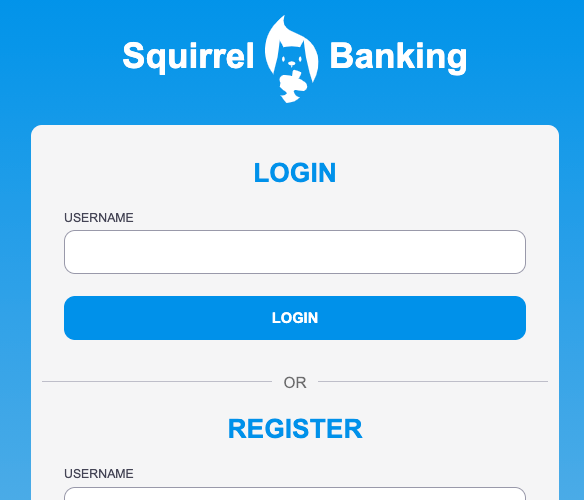
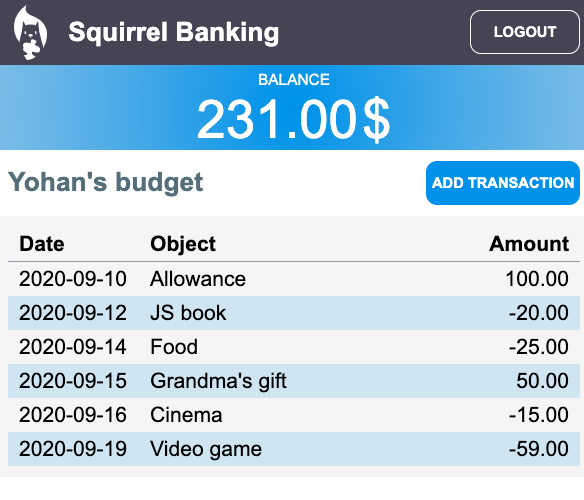

# :dollar: Build a Bank

In this project, you'll learn how to build a fictional bank. These lessons include instruction on how to layout a web site and provide routes, build forms, manage state, and fetch data from an API from which you can fetch the bank's data.

## Lessons

1. [HTML Templates and Routes in a Web App](template-route/README.md)
2. [Build a Login and Registration Form](forms/README.md)
3. [Concepts of State Management](state-management/README.md)
4. [Methods of Fetching and Using Data](data/README.md)

### Credits

These lessons were written with :hearts: by [Yohan Lasorsa](https://twitter.com/sinedied)

